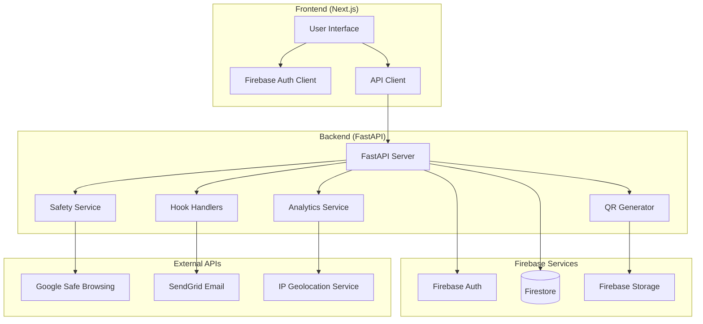
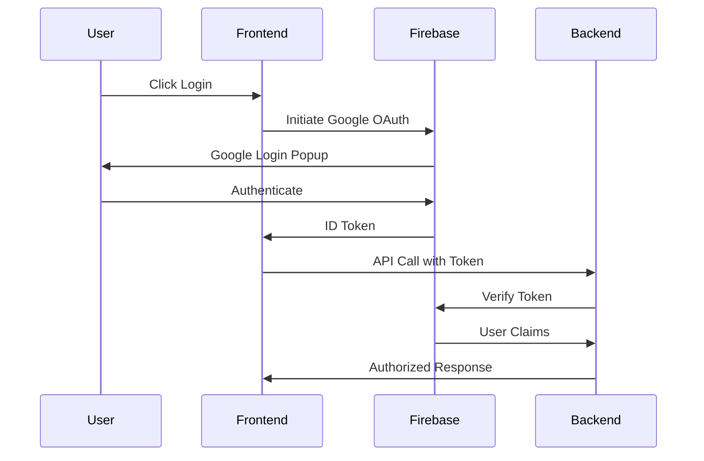

# Design Document

## Overview

The contextual URL shortener is a full-stack application built with Next.js frontend and FastAPI backend, using Firebase for authentication and Firestore for data storage. The system provides contextual domain selection, QR code generation, basic analytics, and comprehensive safety measures.

### Key Design Principles

- **Security First**: All URLs undergo safety validation before creation
- **Scalable Architecture**: Microservices approach with clear separation of concerns  
- **User Experience**: Intuitive interface with contextual domain suggestions
- **Performance**: Efficient data structures and caching strategies
- **Extensibility**: Modular design supporting future feature additions

## Architecture

### System Architecture



### Monorepo Structure

```
go2/
├── .kiro/
│   ├── specs/
│   ├── hooks/
│   └── steering/
├── apps/
│   ├── web/              # Next.js frontend
│   │   ├── src/
│   │   │   ├── components/
│   │   │   ├── pages/
│   │   │   ├── hooks/
│   │   │   ├── lib/
│   │   │   └── types/
│   │   ├── public/
│   │   └── package.json
│   └── api/              # FastAPI backend
│       ├── src/
│       │   ├── routers/
│       │   ├── services/
│       │   ├── models/
│       │   ├── utils/
│       │   └── hooks/
│       ├── tests/
│       └── requirements.txt
├── packages/
│   └── shared/           # Shared types and utilities
└── README.md
```

## Components and Interfaces

### Frontend Components

#### Core Components

1. **LinkCreator Component**
   - URL input with validation
   - Domain dropdown with contextual suggestions
   - Custom code input with availability checking
   - Password and expiration options
   - Real-time form validation

2. **LinkDisplay Component**
   - Short URL with copy functionality
   - QR code preview
   - Analytics link
   - Share options

3. **Analytics Dashboard**
   - Click metrics visualization
   - Time-series charts
   - Geographic analytics with world map
   - Referrer and device breakdowns
   - City/region drill-down capabilities
   - Export functionality

4. **Admin Panel**
   - Link management table
   - Bulk operations
   - User management
   - System statistics

#### Authentication Flow



### Backend Services

#### API Router Structure

1. **Links Router** (`/api/links/`)
   - `POST /shorten` - Create short link
   - `GET /stats/{code}` - Get analytics
   - `PUT /{code}` - Update link (admin)
   - `DELETE /{code}` - Delete link (admin)

2. **QR Router** (`/api/qr/`)
   - `GET /{code}` - Generate/serve QR code

3. **Config Router** (`/api/config/`)
   - `GET /base-domains` - Get allowed domains
   - `GET /plans` - Get plan information

4. **Hooks Router** (`/api/hooks/`)
   - `POST /send_daily_report` - Generate reports
   - `POST /safety_scan` - Manual safety scan

5. **Redirect Handler**
   - `GET /{code}` - Handle redirects (domain root)

#### Service Layer

1. **Safety Service**
   ```python
   class SafetyService:
       def validate_url(self, url: str) -> SafetyResult
       def check_blacklist(self, url: str) -> bool
       def check_safe_browsing(self, url: str) -> bool
       def scan_content_patterns(self, url: str) -> bool
   ```

2. **Analytics Service**
   ```python
   class AnalyticsService:
       def log_click(self, code: str, click_data: ClickData) -> None
       def get_stats(self, code: str, period: str) -> LinkStats
       def get_geographic_stats(self, code: str) -> GeographicStats
       def get_location_from_ip(self, ip: str) -> LocationData
       def export_data(self, code: str, format: str) -> bytes
   ```

3. **QR Service**
   ```python
   class QRService:
       def generate_qr(self, url: str) -> bytes
       def cache_qr(self, code: str, qr_data: bytes) -> str
       def get_cached_qr(self, code: str) -> Optional[str]
   ```

## Data Models

### Firestore Collections

#### Links Collection (`/links/{code}`)

```typescript
interface LinkDocument {
  long_url: string;
  base_domain: 'go2.video' | 'go2.reviews' | 'go2.tools';
  owner_uid: string | null;
  password_hash: string | null;
  expires_at: Timestamp | null;
  disabled: boolean;
  created_at: Timestamp;
  created_by_ip: string | null;
  metadata: {
    title?: string;
    host?: string;
    favicon_url?: string;
  };
  plan_type: 'free' | 'paid';
  is_custom_code: boolean;
}
```

#### Clicks Subcollection (`/links/{code}/clicks/{clickId}`)

```typescript
interface ClickDocument {
  ts: Timestamp;
  ip_hash: string | null;
  ua: string | null;
  referrer: string | null;
  location: {
    country: string | null;
    country_code: string | null;
    region: string | null;
    city: string | null;
    timezone: string | null;
    latitude: number | null;
    longitude: number | null;
  };
  device_type: 'mobile' | 'desktop' | 'tablet' | 'unknown';
  browser: string | null;
  os: string | null;
}
```

#### Users Collection (`/users/{uid}`)

```typescript
interface UserDocument {
  email: string;
  display_name: string;
  plan_type: 'free' | 'paid';
  custom_codes_used: number;
  custom_codes_reset_date: Timestamp;
  created_at: Timestamp;
  last_login: Timestamp;
  is_admin: boolean;
}
```

#### Config Collection (`/config/settings`)

```typescript
interface ConfigDocument {
  base_domains: string[];
  domain_suggestions: {
    [key: string]: string; // hostname -> suggested domain
  };
  safety_settings: {
    enable_safe_browsing: boolean;
    blacklist_domains: string[];
    blacklist_keywords: string[];
  };
  plan_limits: {
    free: { custom_codes: number };
    paid: { custom_codes: number };
  };
}
```

### Firestore Security Rules

```javascript
rules_version = '2';
service cloud.firestore {
  match /databases/{database}/documents {
    // Links - users can read their own, admins can read all
    match /links/{code} {
      allow read: if true; // Public read for redirects
      allow write: if request.auth != null && 
        (request.auth.uid == resource.data.owner_uid || 
         request.auth.token.admin == true);
      allow create: if request.auth != null || 
        request.auth == null; // Allow anonymous creation
      
      // Clicks subcollection - server-side writes only
      match /clicks/{clickId} {
        allow read: if request.auth != null && 
          (request.auth.uid == get(/databases/$(database)/documents/links/$(code)).data.owner_uid ||
           request.auth.token.admin == true);
        allow write: if false; // Server-side only
      }
    }
    
    // Users - own profile only
    match /users/{uid} {
      allow read, write: if request.auth != null && 
        (request.auth.uid == uid || request.auth.token.admin == true);
    }
    
    // Config - read-only for authenticated users
    match /config/{document} {
      allow read: if true;
      allow write: if request.auth != null && 
        request.auth.token.admin == true;
    }
  }
}
```

## Error Handling

### Error Response Format

```typescript
interface ErrorResponse {
  error: {
    code: string;
    message: string;
    details?: any;
  };
}
```

### Error Categories

1. **Validation Errors** (400)
   - Invalid URL format
   - Missing required fields
   - Invalid domain selection

2. **Safety Errors** (403)
   - Blacklisted domain
   - Safe Browsing flagged
   - Adult content detected

3. **Resource Errors** (404/409)
   - Link not found
   - Custom code collision
   - Expired link

4. **Authentication Errors** (401)
   - Invalid Firebase token
   - Insufficient permissions

5. **Rate Limiting Errors** (429)
   - Plan limits exceeded
   - API rate limits

6. **System Errors** (500)
   - Database connection issues
   - External API failures

### Error Handling Strategy

```python
# Backend error handling middleware
@app.exception_handler(ValidationError)
async def validation_exception_handler(request: Request, exc: ValidationError):
    return JSONResponse(
        status_code=400,
        content={
            "error": {
                "code": "VALIDATION_ERROR",
                "message": "Invalid input data",
                "details": exc.errors()
            }
        }
    )

@app.exception_handler(SafetyError)
async def safety_exception_handler(request: Request, exc: SafetyError):
    return JSONResponse(
        status_code=403,
        content={
            "error": {
                "code": "SAFETY_VIOLATION",
                "message": exc.message,
                "details": {"reasons": exc.reasons}
            }
        }
    )
```

## Testing Strategy

### Frontend Testing

1. **Unit Tests** (Jest + React Testing Library)
   - Component rendering
   - Form validation logic
   - Utility functions
   - Custom hooks

2. **Integration Tests**
   - API client interactions
   - Authentication flows
   - Form submission workflows

3. **E2E Tests** (Playwright)
   - Complete user journeys
   - Cross-browser compatibility
   - Mobile responsiveness

### Backend Testing

1. **Unit Tests** (pytest)
   - Service layer functions
   - Validation logic
   - Utility functions
   - Model serialization

2. **Integration Tests**
   - API endpoint responses
   - Database operations
   - External API interactions
   - Authentication middleware

3. **Load Tests** (locust)
   - Redirect performance
   - Concurrent link creation
   - Analytics queries

### Test Data Strategy

- **Fixtures**: Predefined test data for consistent testing
- **Factories**: Dynamic test data generation
- **Mocking**: External API responses and Firebase services
- **Cleanup**: Automated test data cleanup

### Continuous Integration

```yaml
# GitHub Actions workflow
name: CI/CD
on: [push, pull_request]

jobs:
  test-frontend:
    runs-on: ubuntu-latest
    steps:
      - uses: actions/checkout@v3
      - uses: actions/setup-node@v3
      - run: npm ci
      - run: npm run test
      - run: npm run build

  test-backend:
    runs-on: ubuntu-latest
    steps:
      - uses: actions/checkout@v3
      - uses: actions/setup-python@v4
      - run: pip install -r requirements.txt
      - run: pytest
      - run: python -m pytest --cov=src
```

### Performance Considerations

1. **Database Optimization**
   - Composite indexes for analytics queries
   - TTL for expired links
   - Connection pooling

2. **Caching Strategy**
   - QR code caching in Firebase Storage
   - Analytics data caching (Redis if needed)
   - CDN for static assets

3. **Rate Limiting**
   - Per-user rate limits
   - IP-based rate limits
   - Plan-based quotas

4. **Monitoring**
   - Application performance monitoring
   - Error tracking
   - Usage analytics
   - Cost monitoring