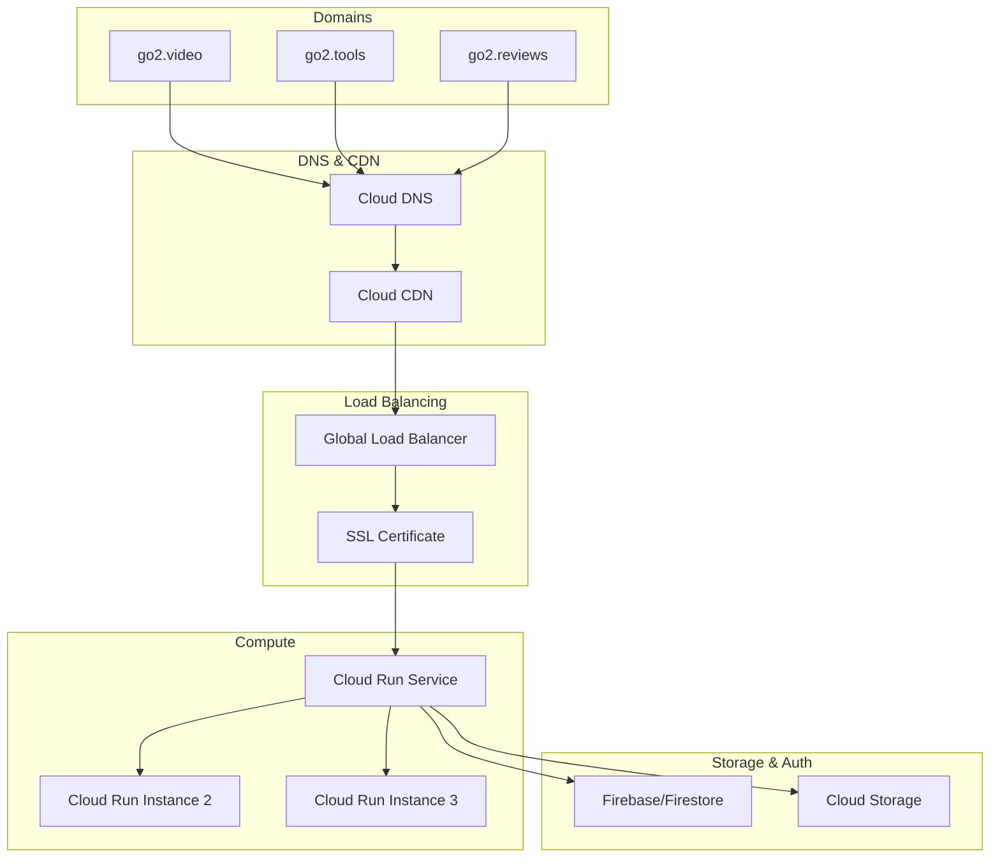

# Go2 URL Shortener - Google Cloud Run Deployment Guide

## Overview

This guide provides comprehensive instructions for deploying the Go2 URL Shortener FastAPI backend to Google Cloud Run with support for multiple domains (go2.video, go2.tools, go2.reviews).

## Table of Contents

1. [Architecture Overview](#architecture-overview)
2. [Prerequisites](#prerequisites)
3. [Google Cloud Setup](#google-cloud-setup)
4. [Domain Configuration](#domain-configuration)
5. [SSL Certificate Setup](#ssl-certificate-setup)
6. [Environment Configuration](#environment-configuration)
7. [Docker Configuration](#docker-configuration)
8. [Cloud Run Deployment](#cloud-run-deployment)
9. [Load Balancer Setup](#load-balancer-setup)
10. [DNS Configuration](#dns-configuration)
11. [Monitoring and Logging](#monitoring-and-logging)
12. [Troubleshooting](#troubleshooting)

## Architecture Overview



### How Multi-Domain Redirection Works

1. **User visits**: `https://go2.video/abc123`
2. **DNS resolves**: Domain points to Google Cloud Load Balancer
3. **Load Balancer**: Routes request to Cloud Run service
4. **FastAPI**: Looks up code `abc123` in Firestore (domain-agnostic)
5. **Redirect**: Returns 302 redirect to original URL
6. **Analytics**: Logs click data with geolocation and device info

## Prerequisites

### Required Accounts & Services
- Google Cloud Platform account with billing enabled
- Domain registrar access for go2.video, go2.tools, go2.reviews
- Firebase project (already set up based on FIREBASE_SETUP.md)

### Required Tools
```bash
# Install Google Cloud CLI
curl https://sdk.cloud.google.com | bash
exec -l $SHELL
gcloud init

# Install Docker
# Follow instructions at https://docs.docker.com/get-docker/

# Verify installations
gcloud --version
docker --version
```

## Google Cloud Setup

### 1. Create/Select Project
```bash
# Create new project (optional)
gcloud projects create go2-url-shortener --name="Go2 URL Shortener"

# Set project
gcloud config set project go2-url-shortener

# Enable required APIs
gcloud services enable run.googleapis.com
gcloud services enable cloudbuild.googleapis.com
gcloud services enable compute.googleapis.com
gcloud services enable dns.googleapis.com
gcloud services enable certificatemanager.googleapis.com
```

### 2. Set Default Region
```bash
# Set region (choose closest to your users)
gcloud config set run/region us-central1
gcloud config set compute/region us-central1
```

## Domain Configuration

### Domain Ownership Verification

1. **Verify domain ownership** in Google Cloud Console:
   ```bash
   # Go to: https://console.cloud.google.com/appengine/settings/domains
   # Add each domain: go2.video, go2.tools, go2.reviews
   ```

2. **Add DNS TXT records** for verification (at your domain registrar):
   ```
   Domain: go2.video
   Type: TXT
   Name: @
   Value: google-site-verification=YOUR_VERIFICATION_CODE
   
   # Repeat for go2.tools and go2.reviews
   ```

## SSL Certificate Setup

### Option 1: Google-Managed SSL Certificate (Recommended)

```bash
# Create managed SSL certificate
gcloud compute ssl-certificates create go2-ssl-cert \
    --domains=go2.video,go2.tools,go2.reviews \
    --global
```

### Option 2: Self-Managed Certificate

If you prefer to use your own certificate:

```bash
# Upload your certificate
gcloud compute ssl-certificates create go2-ssl-cert \
    --certificate=path/to/certificate.crt \
    --private-key=path/to/private.key \
    --global
```

## Environment Configuration

### 1. Create Environment File

Create `apps/api/.env.production`:

```bash
# Firebase Configuration
FIREBASE_SERVICE_ACCOUNT_JSON={"type":"service_account",...}
FIREBASE_STORAGE_BUCKET=your-project.appspot.com

# External APIs
GOOGLE_SAFE_BROWSING_API_KEY=your-safe-browsing-key
SENDGRID_API_KEY=your-sendgrid-key

# Application Settings
ENVIRONMENT=production
LOG_LEVEL=INFO
CORS_ORIGINS=https://go2.video,https://go2.tools,https://go2.reviews

# Optional: Custom domain for admin panel
ADMIN_DOMAIN=admin.go2.video
```

### 2. Create Secret Manager Secrets

```bash
# Store sensitive environment variables in Secret Manager
gcloud secrets create firebase-service-account \
    --data-file=path/to/firebase-service-account.json

gcloud secrets create safe-browsing-api-key \
    --data-file=- <<< "your-api-key"

gcloud secrets create sendgrid-api-key \
    --data-file=- <<< "your-sendgrid-key"
```

## Docker Configuration

### 1. Create Dockerfile

Create `apps/api/Dockerfile`:

```dockerfile
FROM python:3.11-slim

# Set working directory
WORKDIR /app

# Install system dependencies
RUN apt-get update && apt-get install -y \
    gcc \
    && rm -rf /var/lib/apt/lists/*

# Copy requirements and install Python dependencies
COPY requirements.txt .
RUN pip install --no-cache-dir -r requirements.txt

# Copy application code
COPY src/ ./src/
COPY .env.production .env

# Create non-root user
RUN useradd --create-home --shell /bin/bash app \
    && chown -R app:app /app
USER app

# Expose port
EXPOSE 8080

# Health check
HEALTHCHECK --interval=30s --timeout=30s --start-period=5s --retries=3 \
    CMD curl -f http://localhost:8080/health || exit 1

# Start application
CMD ["uvicorn", "src.main:app", "--host", "0.0.0.0", "--port", "8080"]
```

### 2. Create .dockerignore

Create `apps/api/.dockerignore`:

```
__pycache__
*.pyc
*.pyo
*.pyd
.Python
env/
venv/
.venv/
pip-log.txt
pip-delete-this-directory.txt
.tox
.coverage
.coverage.*
.cache
nosetests.xml
coverage.xml
*.cover
*.log
.git
.mypy_cache
.pytest_cache
.hypothesis
tests/
.env.local
.env.development
```

### 3. Update FastAPI for Cloud Run

Update `apps/api/src/main.py` to handle Cloud Run requirements:

```python
import os
import logging
from fastapi import FastAPI
from fastapi.middleware.cors import CORSMiddleware
from dotenv import load_dotenv

# Load environment variables
load_dotenv()

# Configure logging for Cloud Run
logging.basicConfig(
    level=getattr(logging, os.getenv('LOG_LEVEL', 'INFO')),
    format='%(asctime)s - %(name)s - %(levelname)s - %(message)s'
)
logger = logging.getLogger(__name__)

# Initialize Firebase service
from .services.firebase_service import firebase_service

app = FastAPI(
    title="Go2 URL Shortener API",
    description="Production-ready contextual URL shortener with analytics",
    version="1.0.0",
    docs_url="/docs" if os.getenv('ENVIRONMENT') != 'production' else None,
    redoc_url="/redoc" if os.getenv('ENVIRONMENT') != 'production' else None,
)

# Import and register routers
from .routers import links, redirect
app.include_router(links.router)
app.include_router(redirect.router)

# Configure CORS
cors_origins = os.getenv('CORS_ORIGINS', 'http://localhost:3000').split(',')
app.add_middleware(
    CORSMiddleware,
    allow_origins=cors_origins,
    allow_credentials=True,
    allow_methods=["*"],
    allow_headers=["*"],
)

@app.get("/")
async def root():
    return {
        "message": "Go2 URL Shortener API",
        "version": "1.0.0",
        "status": "healthy"
    }

@app.get("/health")
async def health_check():
    """Health check endpoint for Cloud Run"""
    try:
        # Test Firebase connection
        firebase_service.db.collection('config').limit(1).get()
        return {
            "status": "healthy",
            "firebase": "connected",
            "timestamp": os.getenv("TIMESTAMP", "unknown")
        }
    except Exception as e:
        logger.error(f"Health check failed: {e}")
        return {
            "status": "unhealthy",
            "firebase": "disconnected",
            "error": str(e)
        }

# Cloud Run requires listening on PORT environment variable
if __name__ == "__main__":
    import uvicorn
    port = int(os.getenv("PORT", 8080))
    uvicorn.run(app, host="0.0.0.0", port=port)
```

## Cloud Run Deployment

### 1. Build and Deploy

```bash
# Navigate to API directory
cd apps/api

# Build and deploy to Cloud Run
gcloud run deploy go2-api \
    --source . \
    --platform managed \
    --region us-central1 \
    --allow-unauthenticated \
    --port 8080 \
    --memory 1Gi \
    --cpu 1 \
    --min-instances 0 \
    --max-instances 100 \
    --concurrency 80 \
    --timeout 300 \
    --set-env-vars ENVIRONMENT=production \
    --set-secrets FIREBASE_SERVICE_ACCOUNT_JSON=firebase-service-account:latest \
    --set-secrets GOOGLE_SAFE_BROWSING_API_KEY=safe-browsing-api-key:latest \
    --set-secrets SENDGRID_API_KEY=sendgrid-api-key:latest
```

### 2. Configure Service Account Permissions

```bash
# Create service account for Cloud Run
gcloud iam service-accounts create go2-api-sa \
    --display-name "Go2 API Service Account"

# Grant necessary permissions
gcloud projects add-iam-policy-binding go2-url-shortener \
    --member "serviceAccount:go2-api-sa@go2-url-shortener.iam.gserviceaccount.com" \
    --role "roles/secretmanager.secretAccessor"

# Update Cloud Run service to use the service account
gcloud run services update go2-api \
    --service-account go2-api-sa@go2-url-shortener.iam.gserviceaccount.com \
    --region us-central1
```

### 3. Get Cloud Run Service URL

```bash
# Get the service URL
gcloud run services describe go2-api \
    --region us-central1 \
    --format 'value(status.url)'

# Example output: https://go2-api-xyz-uc.a.run.app
```

## Load Balancer Setup

### 1. Create Backend Service

```bash
# Create Network Endpoint Group for Cloud Run
gcloud compute network-endpoint-groups create go2-neg \
    --region=us-central1 \
    --network-endpoint-type=serverless \
    --cloud-run-service=go2-api

# Create backend service
gcloud compute backend-services create go2-backend \
    --global \
    --load-balancing-scheme=EXTERNAL_MANAGED

# Add Cloud Run NEG to backend service
gcloud compute backend-services add-backend go2-backend \
    --global \
    --network-endpoint-group=go2-neg \
    --network-endpoint-group-region=us-central1
```

### 2. Create URL Map

```bash
# Create URL map
gcloud compute url-maps create go2-url-map \
    --default-service go2-backend
```

### 3. Create HTTPS Proxy

```bash
# Create target HTTPS proxy
gcloud compute target-https-proxies create go2-https-proxy \
    --ssl-certificates go2-ssl-cert \
    --url-map go2-url-map
```

### 4. Create Global Forwarding Rule

```bash
# Reserve static IP
gcloud compute addresses create go2-ip --global

# Get the IP address
gcloud compute addresses describe go2-ip --global --format="value(address)"

# Create forwarding rule
gcloud compute forwarding-rules create go2-https-rule \
    --global \
    --target-https-proxy go2-https-proxy \
    --address go2-ip \
    --ports 443
```

### 5. Create HTTP to HTTPS Redirect (Optional)

```bash
# Create HTTP URL map for redirect
gcloud compute url-maps create go2-http-redirect \
    --default-url-redirect-response-code=301 \
    --default-url-redirect-https-redirect

# Create HTTP proxy
gcloud compute target-http-proxies create go2-http-proxy \
    --url-map go2-http-redirect

# Create HTTP forwarding rule
gcloud compute forwarding-rules create go2-http-rule \
    --global \
    --target-http-proxy go2-http-proxy \
    --address go2-ip \
    --ports 80
```

## DNS Configuration

### 1. Create Cloud DNS Zone (Optional)

If you want to manage DNS through Google Cloud:

```bash
# Create DNS zone for each domain
gcloud dns managed-zones create go2-video-zone \
    --dns-name go2.video \
    --description "DNS zone for go2.video"

gcloud dns managed-zones create go2-tools-zone \
    --dns-name go2.tools \
    --description "DNS zone for go2.tools"

gcloud dns managed-zones create go2-reviews-zone \
    --dns-name go2.reviews \
    --description "DNS zone for go2.reviews"
```

### 2. Configure DNS Records

At your domain registrar or in Cloud DNS, create these records:

```bash
# Get your static IP
STATIC_IP=$(gcloud compute addresses describe go2-ip --global --format="value(address)")

# DNS Records to create:
# Type: A, Name: @, Value: $STATIC_IP (for each domain)
# Type: A, Name: www, Value: $STATIC_IP (for each domain)
```

**Manual DNS Configuration:**
```
Domain: go2.video
Type: A
Name: @
Value: YOUR_STATIC_IP
TTL: 300

Domain: go2.video  
Type: A
Name: www
Value: YOUR_STATIC_IP
TTL: 300

# Repeat for go2.tools and go2.reviews
```

### 3. Verify DNS Propagation

```bash
# Check DNS propagation
dig go2.video
dig go2.tools  
dig go2.reviews

# Or use online tools like:
# https://www.whatsmydns.net/
```

## Monitoring and Logging

### 1. Enable Cloud Monitoring

```bash
# Cloud Run automatically sends metrics to Cloud Monitoring
# View metrics at: https://console.cloud.google.com/monitoring

# Create custom dashboard
gcloud alpha monitoring dashboards create --config-from-file=dashboard.json
```

### 2. Set Up Alerting

Create `alerting-policy.yaml`:

```yaml
displayName: "Go2 API High Error Rate"
conditions:
  - displayName: "Error rate > 5%"
    conditionThreshold:
      filter: 'resource.type="cloud_run_revision" resource.label.service_name="go2-api"'
      comparison: COMPARISON_GREATER_THAN
      thresholdValue: 0.05
      duration: 300s
notificationChannels:
  - projects/go2-url-shortener/notificationChannels/YOUR_CHANNEL_ID
```

```bash
# Create alerting policy
gcloud alpha monitoring policies create --policy-from-file=alerting-policy.yaml
```

### 3. Log Analysis

```bash
# View logs
gcloud logging read 'resource.type="cloud_run_revision" resource.labels.service_name="go2-api"' \
    --limit 50 \
    --format json

# Create log-based metrics
gcloud logging metrics create redirect_count \
    --description="Count of redirects" \
    --log-filter='resource.type="cloud_run_revision" "redirect_to_long_url"'
```

## Security Configuration

### 1. Cloud Armor (Optional)

```bash
# Create security policy
gcloud compute security-policies create go2-security-policy \
    --description "Security policy for Go2 API"

# Add rate limiting rule
gcloud compute security-policies rules create 1000 \
    --security-policy go2-security-policy \
    --expression "true" \
    --action "rate-based-ban" \
    --rate-limit-threshold-count 100 \
    --rate-limit-threshold-interval-sec 60 \
    --ban-duration-sec 600

# Apply to backend service
gcloud compute backend-services update go2-backend \
    --security-policy go2-security-policy \
    --global
```

### 2. IAM Configuration

```bash
# Ensure least privilege access
gcloud run services add-iam-policy-binding go2-api \
    --member="allUsers" \
    --role="roles/run.invoker" \
    --region us-central1

# For admin endpoints, restrict access
gcloud run services remove-iam-policy-binding go2-api \
    --member="allUsers" \
    --role="roles/run.invoker" \
    --region us-central1

# Add specific users/service accounts as needed
```

## Performance Optimization

### 1. Cloud CDN Setup

```bash
# Enable Cloud CDN on backend service
gcloud compute backend-services update go2-backend \
    --enable-cdn \
    --cache-mode CACHE_ALL_STATIC \
    --default-ttl 3600 \
    --max-ttl 86400 \
    --global
```

### 2. Cloud Run Optimization

```bash
# Update service with optimized settings
gcloud run services update go2-api \
    --cpu 2 \
    --memory 2Gi \
    --concurrency 1000 \
    --min-instances 1 \
    --max-instances 100 \
    --execution-environment gen2 \
    --region us-central1
```

## Testing Deployment

### 1. Health Check

```bash
# Test health endpoint
curl -f https://go2.video/health
curl -f https://go2.tools/health  
curl -f https://go2.reviews/health
```

### 2. Create Test Link

```bash
# Create a test link
curl -X POST https://go2.video/api/links/shorten \
  -H "Content-Type: application/json" \
  -d '{
    "long_url": "https://example.com",
    "base_domain": "go2.video"
  }'

# Test redirect
curl -I https://go2.video/YOUR_SHORT_CODE
```

### 3. Load Testing

```bash
# Install Apache Bench
sudo apt-get install apache2-utils

# Run load test
ab -n 1000 -c 10 https://go2.video/health
```

## Troubleshooting

### Common Issues

1. **SSL Certificate Not Ready**
   ```bash
   # Check certificate status
   gcloud compute ssl-certificates describe go2-ssl-cert --global
   
   # Status should be "ACTIVE" - may take 10-60 minutes
   ```

2. **DNS Not Resolving**
   ```bash
   # Check DNS propagation
   nslookup go2.video
   
   # Verify A records point to your static IP
   ```

3. **Cloud Run Service Errors**
   ```bash
   # Check logs
   gcloud logging read 'resource.type="cloud_run_revision"' --limit 50
   
   # Check service status
   gcloud run services describe go2-api --region us-central1
   ```

4. **Load Balancer Issues**
   ```bash
   # Check backend health
   gcloud compute backend-services get-health go2-backend --global
   
   # Verify URL map
   gcloud compute url-maps describe go2-url-map
   ```

### Debug Commands

```bash
# Test Cloud Run service directly
CLOUD_RUN_URL=$(gcloud run services describe go2-api --region us-central1 --format 'value(status.url)')
curl -f $CLOUD_RUN_URL/health

# Test load balancer
curl -H "Host: go2.video" http://YOUR_STATIC_IP/health

# Check certificate
openssl s_client -connect go2.video:443 -servername go2.video
```

## Cost Optimization

### 1. Cloud Run Pricing

- **CPU**: $0.00002400 per vCPU-second
- **Memory**: $0.00000250 per GiB-second  
- **Requests**: $0.40 per million requests
- **Free tier**: 2 million requests/month

### 2. Optimization Tips

```bash
# Use minimum resources for low traffic
gcloud run services update go2-api \
    --cpu 1 \
    --memory 512Mi \
    --min-instances 0 \
    --region us-central1

# Enable CPU throttling
gcloud run services update go2-api \
    --cpu-throttling \
    --region us-central1
```

## Maintenance

### 1. Updates

```bash
# Deploy new version
gcloud run deploy go2-api \
    --source . \
    --region us-central1

# Rollback if needed
gcloud run services update-traffic go2-api \
    --to-revisions PREVIOUS_REVISION=100 \
    --region us-central1
```

### 2. Backup Strategy

```bash
# Firestore is automatically backed up
# For additional backups, export data:
gcloud firestore export gs://your-backup-bucket/$(date +%Y%m%d)
```

## Conclusion

This deployment setup provides:

- ✅ **Multi-domain support** (go2.video, go2.tools, go2.reviews)
- ✅ **Auto-scaling** with Cloud Run
- ✅ **Global load balancing** with SSL termination
- ✅ **Monitoring and alerting**
- ✅ **Security** with Cloud Armor
- ✅ **Cost optimization** with serverless architecture

Your Go2 URL Shortener is now ready for production traffic across all three domains!

## Support

For issues or questions:
1. Check Cloud Run logs: `gcloud logging read 'resource.type="cloud_run_revision"'`
2. Monitor metrics in Cloud Console
3. Review this guide's troubleshooting section
4. Check Firebase console for database issues

---

**Next Steps**: Consider setting up CI/CD with Cloud Build for automated deployments.