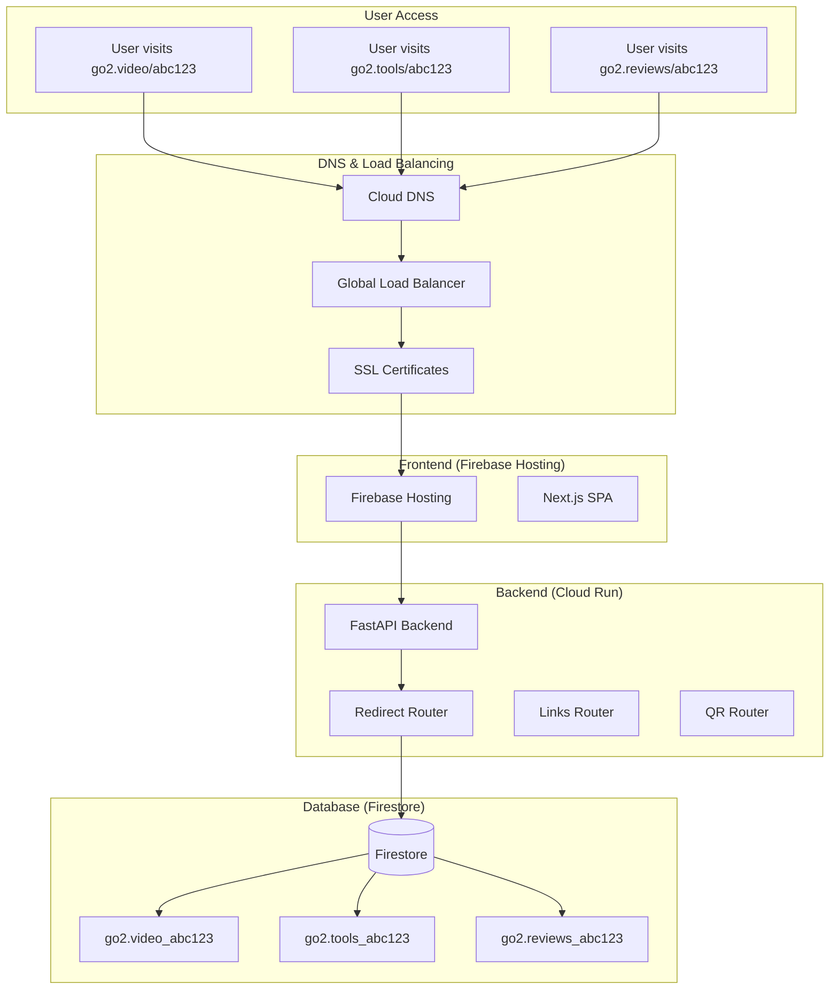
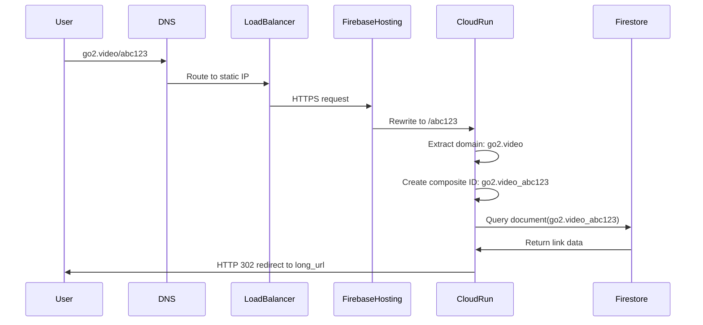
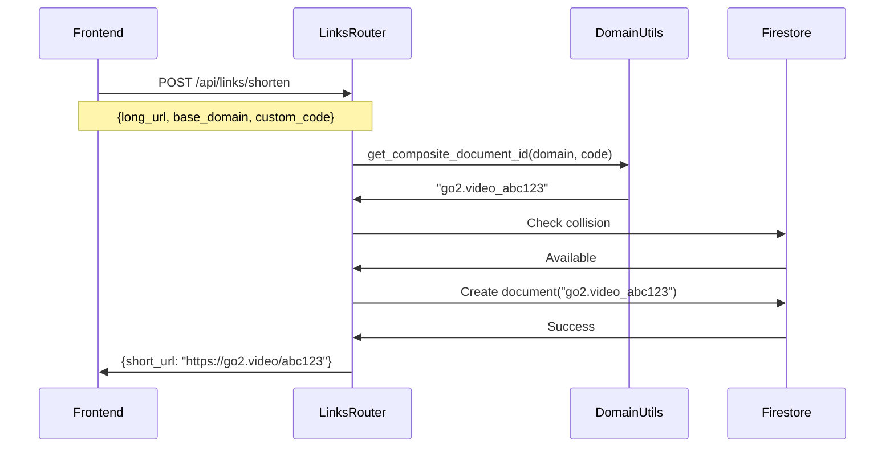
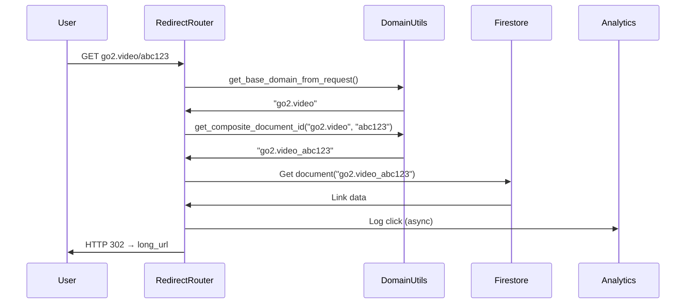
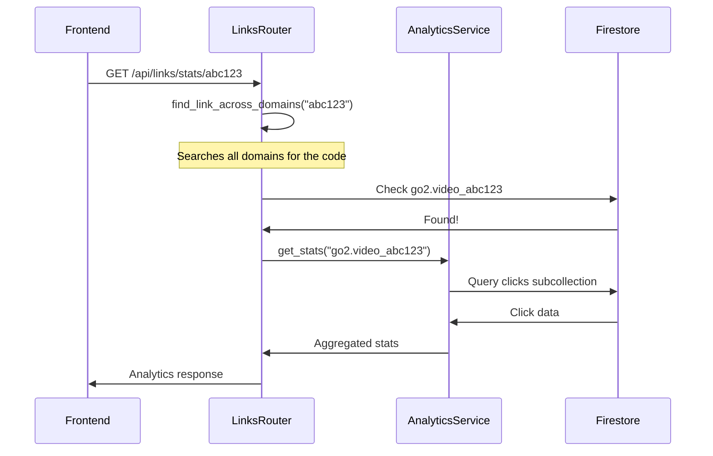

# Go2 URL Shortener - Multi-Domain Architecture Documentation

## Table of Contents
1. [Overview](#overview)
2. [Architecture Design](#architecture-design)
3. [Domain Handling System](#domain-handling-system)
4. [Composite Document ID System](#composite-document-id-system)
5. [Request Flow](#request-flow)
6. [API Documentation](#api-documentation)
7. [Database Schema](#database-schema)
8. [Implementation Details](#implementation-details)
9. [Testing Guide](#testing-guide)
10. [Troubleshooting](#troubleshooting)

## Overview

The Go2 URL Shortener is a production-ready, multi-domain URL shortening service that supports three contextual domains:
- **go2.video** - For video content (YouTube, Vimeo, etc.)
- **go2.tools** - For tools and utilities (GitHub, documentation, etc.)
- **go2.reviews** - For review sites (Amazon, Yelp, etc.)

### Key Features
- ✅ **Multi-Domain Support**: Same short codes can exist across different domains
- ✅ **Contextual Suggestions**: Automatic domain suggestions based on URL content
- ✅ **Single Infrastructure**: One backend serves all domains
- ✅ **Domain-Specific Analytics**: Track performance per domain
- ✅ **Composite Document IDs**: Prevent code collisions between domains

## Architecture Design

### High-Level Architecture



### Domain Resolution Flow



## Domain Handling System

### Domain Utilities (`apps/api/src/utils/domain_utils.py`)

The domain utilities module provides centralized functions for handling multi-domain operations:

```python
def get_base_domain_from_host(host: str) -> str:
    """Extract base domain from request host header"""
    
def get_composite_document_id(base_domain: str, code: str) -> str:
    """Create composite document ID: {domain}_{code}"""
    
def extract_code_from_document_id(document_id: str) -> tuple[str, str]:
    """Extract (base_domain, code) from composite document ID"""
    
def get_short_url(base_domain: str, code: str) -> str:
    """Create full short URL: https://{domain}/{code}"""
```

### Domain Mapping

The system maps various host headers to canonical base domains:

| Host Header | Base Domain | Use Case |
|-------------|-------------|----------|
| `go2.video` | `go2.video` | Video content |
| `www.go2.video` | `go2.video` | WWW redirect |
| `go2.tools` | `go2.tools` | Tools & utilities |
| `www.go2.tools` | `go2.tools` | WWW redirect |
| `go2.reviews` | `go2.reviews` | Reviews & shopping |
| `www.go2.reviews` | `go2.reviews` | WWW redirect |
| `localhost` | `go2.tools` | Development fallback |

## Composite Document ID System

### Problem Solved

**Before**: Single document IDs caused collisions
```
go2.video/abc123  → Document ID: "abc123"
go2.tools/abc123  → Document ID: "abc123"  ❌ COLLISION!
```

**After**: Composite document IDs prevent collisions
```
go2.video/abc123  → Document ID: "go2.video_abc123"
go2.tools/abc123  → Document ID: "go2.tools_abc123"
go2.reviews/abc123 → Document ID: "go2.reviews_abc123"
```

### Implementation

#### Document ID Format
```
{base_domain}_{short_code}
```

Examples:
- `go2.video_demo` → https://go2.video/demo
- `go2.tools_api-docs` → https://go2.tools/api-docs
- `go2.reviews_product-123` → https://go2.reviews/product-123

#### Backward Compatibility
Legacy document IDs (without domain prefix) are handled gracefully:
- If no underscore found, assume `go2.tools` domain
- Existing links continue to work without migration

## Request Flow

### 1. Link Creation Flow



### 2. Redirect Flow



### 3. Analytics Flow



## API Documentation

### Links API

#### Create Short Link
```http
POST /api/links/shorten
Content-Type: application/json

{
  "long_url": "https://youtube.com/watch?v=example",
  "base_domain": "go2.video",
  "custom_code": "my-video",
  "password": "optional",
  "expires_at": "2024-12-31T23:59:59Z"
}
```

**Response:**
```json
{
  "short_url": "https://go2.video/my-video",
  "code": "my-video",
  "qr_url": "/api/qr/go2.video_my-video",
  "long_url": "https://youtube.com/watch?v=example",
  "base_domain": "go2.video",
  "expires_at": "2024-12-31T23:59:59Z"
}
```

#### Get Link Statistics
```http
GET /api/links/stats/{code}?period=7d
```

**Response:**
```json
{
  "total_clicks": 150,
  "clicks_by_day": {
    "2024-01-01": 25,
    "2024-01-02": 30
  },
  "top_referrers": [
    {"referrer": "twitter.com", "count": 45},
    {"referrer": "facebook.com", "count": 30}
  ],
  "top_countries": [
    {"country": "United States", "count": 60},
    {"country": "India", "count": 40}
  ],
  "device_breakdown": {
    "mobile": 80,
    "desktop": 60,
    "tablet": 10
  }
}
```

### QR Code API

#### Generate QR Code
```http
GET /api/qr/{document_id}?size=medium
```

**Parameters:**
- `document_id`: Composite document ID (e.g., `go2.video_abc123`)
- `size`: `small`, `medium`, or `large`

**Response:** PNG image with appropriate caching headers

### Redirect API

#### Handle Redirect
```http
GET /{code}
Host: go2.video
```

**Flow:**
1. Extract domain from `Host` header → `go2.video`
2. Create composite ID → `go2.video_{code}`
3. Look up link in Firestore
4. Log analytics (async)
5. Return HTTP 302 redirect

## Database Schema

### Firestore Collections

#### Links Collection (`/links/{composite_document_id}`)

```typescript
interface LinkDocument {
  long_url: string;                    // Destination URL
  base_domain: 'go2.video' | 'go2.tools' | 'go2.reviews';
  owner_uid: string | null;            // User who created the link
  password_hash: string | null;        // Hashed password for protection
  expires_at: Timestamp | null;        // Expiration date
  disabled: boolean;                   // Admin disable flag
  created_at: Timestamp;               // Creation timestamp
  created_by_ip: string | null;        // Hashed creator IP
  metadata: {                          // URL metadata
    title?: string;
    host?: string;
    favicon_url?: string;
  };
  plan_type: 'free' | 'paid';         // User's plan
  is_custom_code: boolean;             // Whether code was custom
}
```

**Document ID Examples:**
- `go2.video_abc123`
- `go2.tools_my-project`
- `go2.reviews_product-review`

#### Clicks Subcollection (`/links/{composite_document_id}/clicks/{click_id}`)

```typescript
interface ClickDocument {
  ts: Timestamp;                       // Click timestamp
  ip_hash: string | null;              // Hashed IP address
  ua: string | null;                   // User agent string
  referrer: string | null;             // Referrer URL
  location: {                          // Geolocation data
    country: string | null;
    country_code: string | null;
    region: string | null;
    city: string | null;
    timezone: string | null;
    latitude: number | null;
    longitude: number | null;
  };
  device_type: 'mobile' | 'desktop' | 'tablet' | 'unknown';
  browser: string | null;              // Browser name
  os: string | null;                   // Operating system
}
```

### Firestore Security Rules

```javascript
rules_version = '2';
service cloud.firestore {
  match /databases/{database}/documents {
    // Links - public read for redirects, authenticated write
    match /links/{composite_document_id} {
      allow read: if true;  // Public read for redirects
      allow create: if request.auth != null || request.auth == null;  // Allow anonymous
      allow update, delete: if request.auth != null && 
        (request.auth.uid == resource.data.owner_uid || 
         request.auth.token.admin == true);
      
      // Clicks subcollection - server-side writes only
      match /clicks/{clickId} {
        allow read: if request.auth != null && 
          (request.auth.uid == getOwnerFromCompositeId(composite_document_id) ||
           request.auth.token.admin == true);
        allow write: if false;  // Server-side only
      }
    }
  }
}
```

## Implementation Details

### Key Components

#### 1. Domain Utilities (`apps/api/src/utils/domain_utils.py`)
- Centralized domain handling logic
- Composite document ID management
- Host header parsing and validation

#### 2. Redirect Router (`apps/api/src/routers/redirect.py`)
- Handles `/{code}` requests
- Extracts domain from request headers
- Performs composite document ID lookups
- Manages password protection and expiration

#### 3. Links Router (`apps/api/src/routers/links.py`)
- Link CRUD operations with composite IDs
- Cross-domain search functionality
- Code collision checking per domain
- Analytics integration

#### 4. QR Router (`apps/api/src/routers/qr.py`)
- QR code generation with composite IDs
- Domain-aware URL construction
- Caching and optimization

### Helper Functions

#### Cross-Domain Search
```python
async def find_link_across_domains(code: str) -> tuple[Optional[Dict], Optional[str]]:
    """Search all domains for a code, return (link_data, domain)"""
    domains = ['go2.video', 'go2.tools', 'go2.reviews']
    for domain in domains:
        document_id = get_composite_document_id(domain, code)
        # ... search logic
```

#### Code Collision Checking
```python
async def check_code_collision(code: str, base_domain: str) -> bool:
    """Check if code exists in specific domain"""
    document_id = get_composite_document_id(base_domain, code)
    return firebase_service.db.collection('links').document(document_id).get().exists
```

## Testing Guide

### Unit Tests

#### Domain Utilities Tests
```python
def test_get_composite_document_id():
    assert get_composite_document_id("go2.video", "abc123") == "go2.video_abc123"

def test_extract_code_from_document_id():
    domain, code = extract_code_from_document_id("go2.video_abc123")
    assert domain == "go2.video"
    assert code == "abc123"

def test_legacy_document_id():
    domain, code = extract_code_from_document_id("abc123")
    assert domain == "go2.tools"  # Default fallback
    assert code == "abc123"
```

#### Multi-Domain Link Creation
```python
async def test_same_code_different_domains():
    # Create same code on different domains
    video_link = await create_link("https://youtube.com", "go2.video", "demo")
    tools_link = await create_link("https://github.com", "go2.tools", "demo")
    
    assert video_link.short_url == "https://go2.video/demo"
    assert tools_link.short_url == "https://go2.tools/demo"
    
    # Both should exist independently
    assert video_link.code == tools_link.code == "demo"
    assert video_link.base_domain != tools_link.base_domain
```

### Integration Tests

#### Redirect Flow Test
```python
async def test_multi_domain_redirect():
    # Create links on different domains
    await create_link("https://youtube.com/video1", "go2.video", "test")
    await create_link("https://github.com/repo", "go2.tools", "test")
    
    # Test redirects
    video_response = await client.get("/test", headers={"Host": "go2.video"})
    tools_response = await client.get("/test", headers={"Host": "go2.tools"})
    
    assert video_response.status_code == 302
    assert video_response.headers["location"] == "https://youtube.com/video1"
    
    assert tools_response.status_code == 302
    assert tools_response.headers["location"] == "https://github.com/repo"
```

### End-to-End Tests

#### Full User Journey
```typescript
test('Multi-domain link creation and redirect', async ({ page }) => {
  // Create link on go2.video
  await page.goto('https://go2.video');
  await page.fill('[data-testid="url-input"]', 'https://youtube.com/watch?v=test');
  await page.fill('[data-testid="custom-code"]', 'my-video');
  await page.click('[data-testid="create-link"]');
  
  // Verify short URL
  const shortUrl = await page.textContent('[data-testid="short-url"]');
  expect(shortUrl).toBe('https://go2.video/my-video');
  
  // Test redirect
  await page.goto('https://go2.video/my-video');
  await page.waitForURL('https://youtube.com/watch?v=test');
  
  // Create same code on different domain
  await page.goto('https://go2.tools');
  await page.fill('[data-testid="url-input"]', 'https://github.com/my-project');
  await page.fill('[data-testid="custom-code"]', 'my-video');
  await page.click('[data-testid="create-link"]');
  
  // Should succeed (no collision)
  const toolsShortUrl = await page.textContent('[data-testid="short-url"]');
  expect(toolsShortUrl).toBe('https://go2.tools/my-video');
});
```

## Troubleshooting

### Common Issues

#### 1. Link Not Found (404)
**Symptoms**: User gets 404 when accessing short link
**Causes**:
- Incorrect domain extraction
- Composite document ID mismatch
- Legacy document ID handling

**Debug Steps**:
```bash
# Check logs for domain extraction
gcloud logging read 'resource.type="cloud_run_revision" "Redirect request"' --limit 10

# Verify document exists in Firestore
# Check both composite and legacy formats
```

#### 2. Code Collision False Positives
**Symptoms**: System reports code is taken when it should be available
**Causes**:
- Checking wrong domain
- Cross-domain collision logic error

**Debug Steps**:
```python
# Test collision checking
await check_code_collision("test-code", "go2.video")  # Should check specific domain
```

#### 3. Analytics Not Working
**Symptoms**: Click tracking not recording properly
**Causes**:
- Composite document ID not passed to analytics
- Subcollection path incorrect

**Debug Steps**:
```bash
# Check analytics service logs
gcloud logging read 'resource.type="cloud_run_revision" "analytics"' --limit 10
```

#### 4. QR Code Generation Fails
**Symptoms**: QR codes return 404 or wrong URL
**Causes**:
- Document ID format mismatch
- URL construction error

**Debug Steps**:
```python
# Test QR URL construction
document_id = "go2.video_abc123"
base_domain, code = extract_code_from_document_id(document_id)
short_url = get_short_url(base_domain, code)
print(f"QR URL should be: {short_url}")
```

### Performance Monitoring

#### Key Metrics to Monitor
- **Redirect Latency**: Time from request to redirect response
- **Domain Resolution Success Rate**: Percentage of successful domain extractions
- **Cross-Domain Search Performance**: Time to find links across domains
- **Composite ID Collision Rate**: Frequency of ID generation retries

#### Monitoring Queries
```bash
# Redirect performance
gcloud logging read 'resource.type="cloud_run_revision" "redirect successful"' --limit 100

# Domain extraction issues
gcloud logging read 'resource.type="cloud_run_revision" "domain extraction"' --limit 50

# Cross-domain search performance
gcloud logging read 'resource.type="cloud_run_revision" "find_link_across_domains"' --limit 50
```

### Maintenance Tasks

#### Weekly Tasks
- Monitor cross-domain search performance
- Check for any legacy document ID issues
- Verify analytics data consistency across domains

#### Monthly Tasks
- Review composite document ID distribution
- Analyze domain usage patterns
- Optimize cross-domain search if needed

---

## Conclusion

The multi-domain architecture with composite document IDs provides a robust, scalable solution for contextual URL shortening. The system maintains backward compatibility while enabling powerful new features like domain-specific analytics and collision-free code reuse across domains.

**Key Benefits Achieved:**
- ✅ True multi-domain support with isolated namespaces
- ✅ Contextual branding and user experience
- ✅ Scalable architecture for future domain additions
- ✅ Comprehensive analytics and monitoring
- ✅ Production-ready deployment configuration

This architecture positions the Go2 URL Shortener as a best-in-class contextual URL shortening service. 🎯